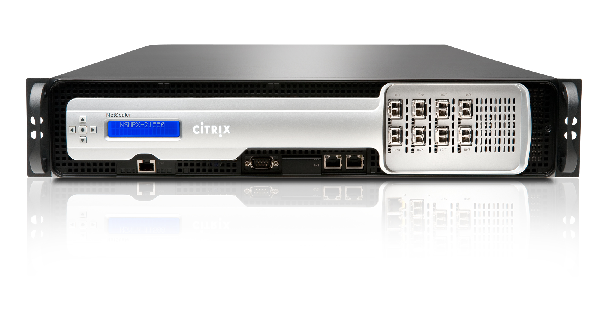

# [NetScaler ADC](https://www.citrix.com/products/netscaler-adc/)

NetScaler ADC is an application delivery controller that provides flexible delivery services for traditional, containerized and microservice applications from your data center or any cloud. It features unmatched security, superior L4-7 load balancing, reliable GSLB, and 100 percent uptime. Plus, it helps you control costs by scaling capacity up when you need it and down when you don’t—and you can even share capacity across instances on premises and in the cloud.  

View the platforms and functional data sheet to compare the various offerings with Citrix's NetScaler ADC. [Click here](https://www.citrix.com/products/netscaler-adc/netscaler-data-sheet.html) to view.

# Overview 

This repository serves to index and allows for navigation through the growing content specifically focused on NetScaler ADC within the [Citrix-TechSpecialist](https://github.com/Citrix-TechSpecialist) Github organization. Here you can find tutorials, reference guides and auxiliary tools to better accustom yourself with NetScaler ADC and how to manage and administer the networking appliance. 

## AWS 

This directory holds all relevant submodules within the [Citrix-TechSpecialist](https://github.com/Citrix-TechSpecialist) organization of NetScaler deployed in AWS Cloud along with general information on how to manage AWS resources.

**[NetScaler-in-AWS-101](https://github.com/Citrix-TechSpecialist/NetScaler-in-AWS-101)**

In this tutorial, we will explore the basics of AWS when provisioning:

   1. Networking resources
   2. Compute resources
   3. Storage Resources. 
  
  After learning the basics and configuring pre-requisite networking, we will then [deploy NetScaler ADC in AWS](https://www.youtube.com/watch?v=NvncDbmzgnY) to show how you can Load Balance a simple Website hosted on an EC2 instance via the NetScaler ADC.

## Azure 

This directory holds all relevant submodules within the [Citrix-TechSpecialist](https://github.com/Citrix-TechSpecialist) organization of NetScaler deployed in Microsoft's Azure Cloud along with general information on how to manage Azure resources.

**[NetScaler-in-Azure-101](https://github.com/Citrix-TechSpecialist/NetScaler-in-Azure-101)**

This tutorial describes how to deploy NetScaler VPX in single IP  mode in Azure Resource Manager (ARM). For more detailed information on how to deploy NetScaler VPX in Azure, see official documentation [here](https://docs.citrix.com/en-us/netscaler/11-1/deploying-vpx/deploy-vpx-on-azure/configure-vpx-onazure.html).

## CPX

This directory holds all relevant submodules within the [Citrix-TechSpecialist](https://github.com/Citrix-TechSpecialist) organization for [NetScaler CPX](microloadbalancer.com), a Docker containerized version of NetScaler.

**[GKE-cpx-proxy](https://github.com/Citrix-TechSpecialist/GKE-cpx-proxy)**

This tutorial demonstrates how to deploy NetScaler CPX as a replacement for [Kube-Proxy](https://kubernetes.io/docs/admin/kube-proxy/) for E-W Load Balancing within Kubernetes. The tutorial operates as an example in [Google Container Engine (GKE)](https://cloud.google.com/container-engine/) but can be used as reference for any on-prem Kubernetes deployment as well. 

**[GoLang-cpx](https://github.com/Citrix-TechSpecialist/GoLang-cpx/)**

This is a portable Blog written by [@btannous](github.com/btannous/) explaining how to code in GoLang to send [NITRO API](http://docs.citrix.com/en-us/netscaler/12/nitro-api.html) calls to NetScaler CPX for management and configuration. This blog provides sample scripts and code to help getting started with one of many ways to interrogate and administer NetScaler CPX for container load balancing and microservices delivery. 

## NITRO 

This directory holds all relevant collateral pertaining to NetScaler's robust [NITRO API](http://docs.citrix.com/en-us/netscaler/12/nitro-api.html) within the [Citrix-TechSpecialist](https://github.com/Citrix-TechSpecialist) organization.

**[nitro-ide](https://github.com/Citrix-TechSpecialist/nitro-ide/)**

This project helps initialize a sandbox environment to develop automation solutions for [NetScaler ADC 12.0](nitro-python-1.0/docs/html/index.html) and [NetScaler MAS 12.0](nitro-python-1.0/doc/index.html) using Nitro API written in Python. 

This project creates a Docker environment for sandboxing and can be deployed as a single standalone container for a independent IDE to interrogate MPX, VPX, and MAS via [Cloud9](https://c9.io/) or via a self-contained local sandbox environment to interrogate CPX within the default Docker network using docker-compose.

**[NetscalerNITRO](https://github.com/Citrix-TechSpecialist/NetScalerNITRO)**

This project is a tool developed by [@btannous](github.com/btannous/) to help get started with NITRO's Python SDK and provides sample code on how to quickly configure target NetScaler ADC's based on desired state configuration defined by a single JSON input file. 

## Utilities 

This directory holds a collection of tools and container services that can be used for POCs, Labs, and for testing purposes with NetScaler ADC.

**[backdoor](https://github.com/Citrix-TechSpecialist/backdoor/)**

This is a container which serves as a sandbox for secure backdoor access via SSH. This container can give you a CLI prompt on demand in a clean linux based environment with select packages pre-installed. This docker container is based on docker's [dind](https://github.com/Citrix-TechSpecialist/Backdoor-cli/tree/dind) image that allows nested docker containers to run for self-contained container development and testing and comes pre-installed with [kubectl](https://kubernetes.io/docs/user-guide/kubectl-overview/) utility to manage Kubernetes clusters. 

**[management-stack](https://github.com/Citrix-TechSpecialist/management-stack/)**

This project aims to quickly deploy all dependent infrastructure essential to configuring key NetScaler ADC functionality. This project is suited for lab environments for those users looking to create a mini lab with a Bring-Your-Own-NetScaler approach to learn and get hands on experience with configuring NetScaler ADCs. Check out the project to see what all services it deploys to help you quickly get started with minimal overhead. This project allows for quick set up to demonstrate Simple Load balancing, SQL Load Balancing, GLSB, URL Re-write, URL Redirection, AppFirewall, and many more features of NetScaler ADC.

**[scripts](https://github.com/Citrix-TechSpecialist/scripts)**

This section contains a collection of supplementary scripts that may be required by other project workflows to deploy or configure NetScaler or other relevant resources. For instance, there is a [script](https://github.com/Citrix-TechSpecialist/scripts/blob/master/install-docker.sh) that can be pulled to quickly install the latest version of Docker on a linux host. 

**[static-website](https://github.com/Citrix-TechSpecialist/static-website/)**

This is a simple docker container that hosts a basic HTTP website with 4 urls to navigate to. This site can be used for POC or lab environments as a back end server to demonstrate simple Load Balancing, GSLB, Content Switching, Re-write functionality and much more. 

**[vip-crawler](https://github.com/Citrix-TechSpecialist/vip-crawler/)**

This project is a container that helps generate HTTP and HTTPS network traffic through the NetScaler by web scraping front ended VIPs. This allows for Webpage crawling and generates WebInsight and SSL Insight data on NetScaler MAS. 
